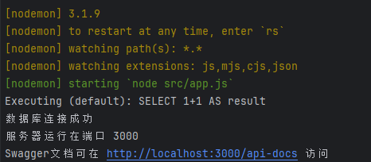
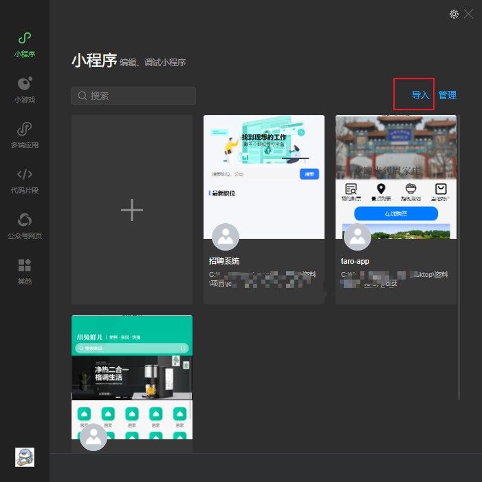
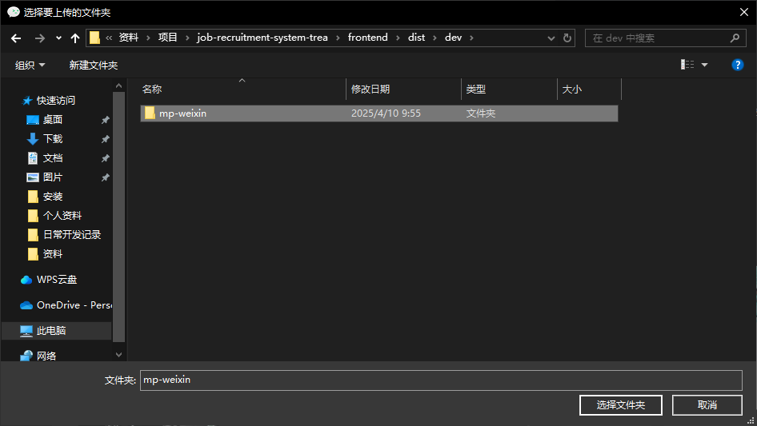
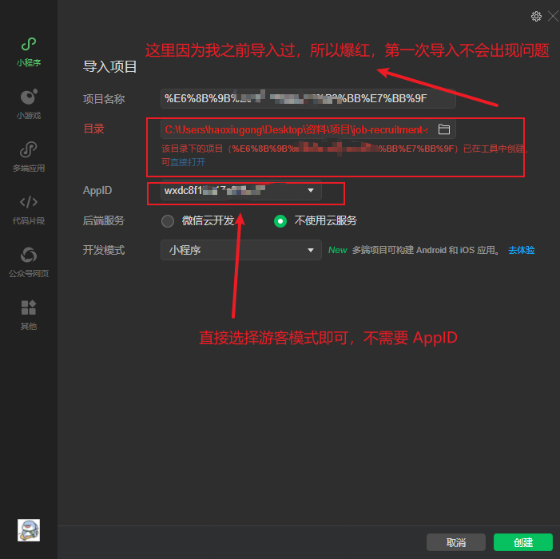
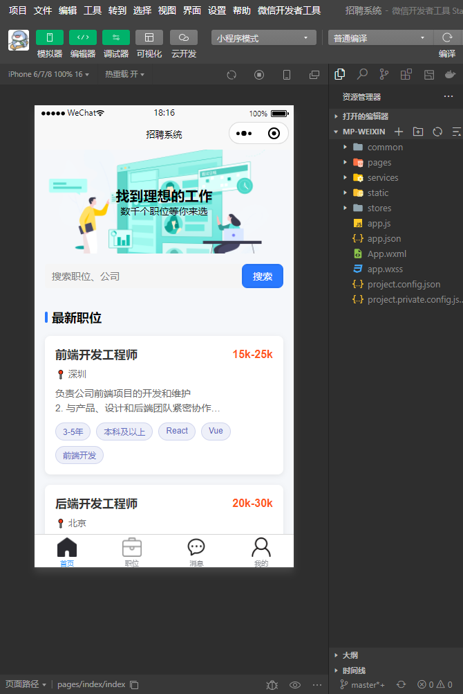

# 招聘系统小程序

## 项目启动

Node.js版本：v20 及以上

### 后端
1. 进入后端目录 `cd backend`
2. 在该目录下安装依赖 `npm install`
3. 配置数据库 
   - 3.1 修改 `backend/.env` 文件中的数据库配置
   - 3.2 修改 `DB_USERNAME` 和 `DB_PASSWORD` 字段为自己数据库的用户名和密码
   - 3.3 创建 mysql 数据库表 `job_recruitment_system`，将数据库结构和数据文件 `backend/sql/job_recruitment_system.sql` 执行
3. 启动项目 `npm run dev`

> 启动后端项目后，前端项目才能正常启动。控制台看到如下信息，表示后端项目启动成功。

### 前端
1. 进入前端目录 `cd frontend`
2. 在该目录下安装依赖 `npm install`
3. 打包成微信小程序 `npm run dev:mp-weixin`
4. 打包后，将 `dist/dev` 目录下的 `mp-weixin` 文件夹导入微信开发者工具

5. 然后就可以正常看到页面了

